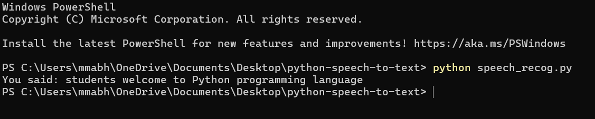

# Python Speech Recognition

Convert .wav audio files to text using Python + Google Speech Recognition API.

## Features
- Converts speech from .wav to text
- Uses Google Speech Recognition API
- Includes sample audio `sample.wav` for testing
- Python 3.12 compatible

## Requirements
```bash
pip install SpeechRecognition pydub

## Sample Output

Command:
```bash
python speech_recog.py sample.wav
'''

**Output:**

Recognizing...
Transcription: students welcome to python programming language


screenshot:

